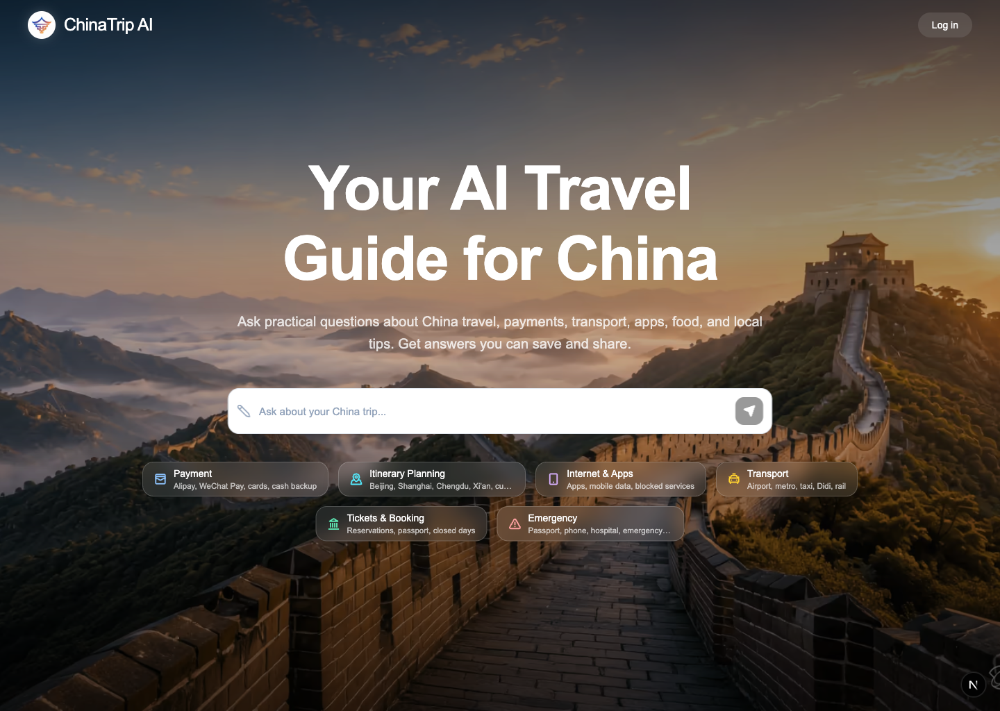
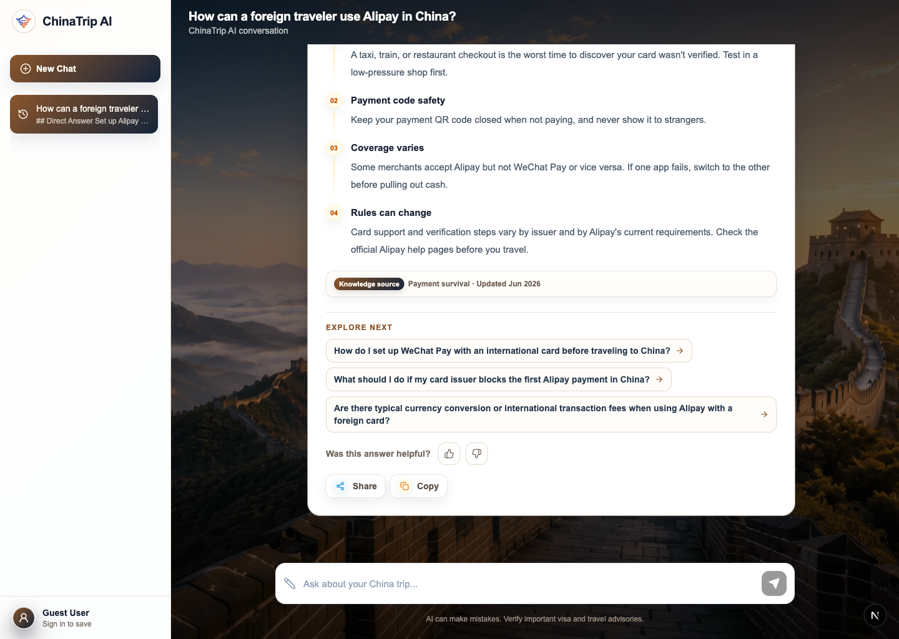

# ChinaTrip AI

ChinaTrip AI is an AI travel guide for international visitors to China. It turns practical travel questions and itinerary requests into clear, actionable answers that can be continued, copied, and shared.

## Product preview

### Home



### Chat



## What it does

- Answers practical questions about payments, transport, internet access, tickets, food, and local travel tips with a structured streaming response.
- Uses RAG retrieval and displays the supporting knowledge sources alongside the answer.
- Detects itinerary-planning requests and asks **0–5** focused Trip setup questions only when they materially improve the plan. It never asks users to choose arrival or departure times.
- Keeps conversations available for both anonymous visitors and signed-in users; Google sign-in makes chats portable across sessions.
- Supports copying answers, creating public share pages, and starting a private chat from a shared answer.
- Adds a one-time 👍 / 👎 quality signal to completed answers. Negative feedback can include an optional reason and comment without requiring sign-in.
- Generates 1–3 **Explore next** follow-up questions after an answer completes. Selecting one continues the current chat directly and skips Trip setup.

## Current release

The current sixth-phase release builds on the core chat, RAG, AI quality, and dynamic itinerary flows with answer feedback and context-aware related questions. It also includes a performance-focused delivery path: a static home page, server-prefetched chat data where available, optimized image delivery, virtualized long conversations, scoped Redis caching, and server timing instrumentation.

## Tech Stack

| Area | Technology |
| --- | --- |
| Web app | Next.js 16, React 19, TypeScript, Tailwind CSS |
| Authentication | Supabase Auth with Google OAuth |
| Data | PostgreSQL + pgvector, Prisma, Supabase |
| AI | DeepSeek answer generation, Doubao / Volcengine Ark embeddings |
| Retrieval and cache | RAG knowledge base, Upstash Redis |
| Client experience | React Query, Zustand, TanStack Virtual |
| Delivery and quality | Vercel, ESLint, AI evaluation Harness |

## Local Development

### Prerequisites

- Node.js 22+
- pnpm 10+
- Docker Desktop
- A pgvector-enabled PostgreSQL instance (the included Docker Compose service is ready to use)

### Start the project

```bash
pnpm install
cp .env.example .env
docker compose up -d
pnpm prisma:migrate
pnpm dev
```

Open [http://localhost:3000](http://localhost:3000).

The local Compose service maps PostgreSQL to port **5433**, so the sample `DATABASE_URL` and `DIRECT_URL` already use `localhost:5433`. Add Supabase and AI provider credentials to `.env` when testing authentication, a live model, embeddings, or Redis. `AI_PROVIDER="mock"` is sufficient for UI development and deterministic local screenshots.

If `POST /api/chats` returns `503 DATABASE_UNAVAILABLE`, first run:

```bash
docker compose ps
pnpm prisma:migrate
```

Then verify that the database URLs still point to port `5433`.

## Quality Checks

```bash
pnpm exec prisma validate
pnpm lint
pnpm ai:harness:smoke
pnpm ai:harness:test
pnpm build
```

Use the full AI Harness when changing prompts, contracts, RAG behavior, or itinerary clarification logic:

```bash
pnpm ai:harness:full
```

## Documentation Index

Product:

- [Phase 1 MVP Product Plan](docs/product/phase-1-mvp.md)
- [Phase 2 Answer Experience Product Plan](docs/product/phase-2-answer-experience.md)
- [Phase 3 RAG Knowledge Base Product Plan](docs/product/phase-3-rag-knowledge-base.md)
- [Phase 4 AI Automation Engineering Plan](docs/product/phase-4-ai-automation.md)
- [Phase 5 Dynamic Trip Clarification Flow](docs/product/phase-5-dynamic-trip-clarification.md)
- [Phase 6 Answer Feedback and Related Questions](docs/product/phase-6-answer-feedback-related-questions.md)
- [Copywriting](docs/product/copywriting.md)
- [User Flows](docs/product/user-flows.md)

Technical:

- [Tech Stack](docs/technical/tech-stack.md)
- [API Design](docs/technical/api-design.md)
- [Database Design](docs/technical/database-design.md)
- [Local Development](docs/technical/local-development.md)
- [AI Evaluation Harness](docs/technical/ai-evaluation-harness.md)
- [Prompt Version and Answer Contract](docs/technical/prompt-version-and-answer-contract.md)
- [Dynamic Trip Clarification Flow](docs/technical/dynamic-trip-clarification-flow.md)

Vibcoding:

- [Workflow](docs/vibcoding/workflow.md)
- [AI Development Rules and Skills](docs/vibcoding/ai-development-skills.md)

AI:

- [Travel Assistant System Prompt](ai/prompts/travel-assistant-system.md)
- [Answer Style](ai/prompts/answer-style.md)
- [Classic Questions](ai/fixtures/classic-questions.json)
- [Mock Chats](ai/fixtures/mock-chats.json)
- [Harness](ai/harness/README.md)
- [Skills](ai/skills/README.md)
- [Prompt Versions](ai/prompts/versions/README.md)

## Development Principles

Keep product behavior private by default: chats, anonymous sessions, profiles, and feedback are owner-scoped; only explicitly shared answers are public. Treat user text and feedback as product data, not as a source for new prompt or RAG content.

When changing AI behavior, update the relevant contract, add or adjust a Harness case, make the smallest safe implementation change, and run the corresponding quality checks.
